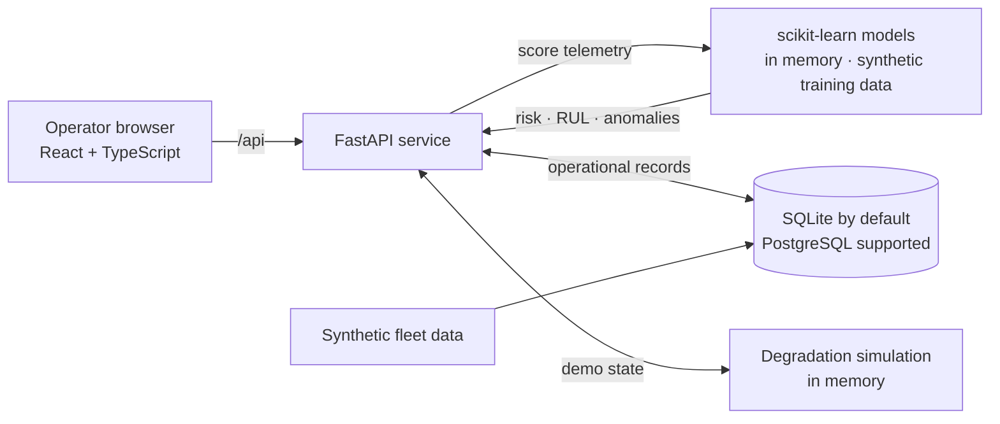
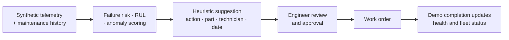

<p align="center">
  
</p>

# AeroSentinel

**Predictive maintenance and fleet-readiness prototype.** AeroSentinel combines aircraft telemetry, component-risk estimates and maintenance workflows in one operations console. Built for SIH 2026 problem 26249.

> **Prototype only.** All fleet and sensor data is synthetic, and the models are trained on synthetic samples without real-world validation. Predictions are advisory and require qualified human review; do not use them for maintenance, airworthiness, dispatch or release decisions. Authentication is disabled, so do not expose this app publicly or use it with real operational data as-is.

## What it does

- Shows fleet readiness, aircraft health, telemetry and an interactive digital twin.
- Estimates component failure risk, remaining useful life (RUL) and anomalies, with simple feature-contribution explanations.
- Suggests maintenance actions, parts, technicians and dates; engineers review recommendations before creating work orders.
- Demonstrates degradation, maintenance completion and simulated aircraft-health recovery.

## Architecture

The UI is a React application. The backend is a single FastAPI service that owns the API, database access and in-process ML pipeline. Local development uses SQLite; PostgreSQL is supported through `DATABASE_URL`.



## Maintenance decision flow



## Console overview

| Area | Route | Main purpose |
|---|---|---|
| Command Center | `/app` | Fleet readiness, aircraft status and current alerts. |
| Fleet | `/app/fleet` | Search and review the aircraft register. |
| Aircraft | `/app/aircraft/:id` | Component health, maintenance history and predictions. |
| Telemetry | `/app/aircraft/:id/telemetry` | Sensor readings, thresholds and anomaly markers. |
| Diagnostics | `/app/aircraft/:id/diagnostics` | Failure risk, RUL, anomaly score and prediction drivers. |
| Digital Twin | `/app/aircraft/:id/twin` | Interactive aircraft subsystem schematic. |
| Maintenance | `/app/work-orders`, `/app/recommendations` | Review recommendations and track work orders. |
| Logistics | `/app/inventory` | Spare-parts stock and forecast views. |
| Analytics | `/app/analytics`, `/app/failure-analysis`, `/app/whatif` | Availability, failure analysis and scenario projections. |
| System | `/app/system`, `/app/data-sources`, `/app/thread`, `/app/copilot`, `/app/audit` | Data quality, CSV profiling, digital thread, query console and audit trail. |

## Models and demo data

On an empty database, the backend seeds 24 fictional aircraft with synthetic telemetry, component and maintenance records. It also creates demo parts, technicians, alerts and model-registry entries.

The backend fits three scikit-learn models in memory when it starts:

| Output | Model | How to interpret it |
|---|---|---|
| Failure probability | `RandomForestClassifier` | Trained on a synthetic failure label; not a real-world failure probability. |
| RUL in days | `RandomForestRegressor` | Trained on a synthetic target; the displayed range is a fixed ±25% band. |
| Anomaly score | `IsolationForest` | Unsupervised score with additional high-vibration and high-temperature rules. |

Training data is generated in-process (4,000 synthetic samples); there is no external dataset or saved model artifact. Models are refit at each backend start. Prediction explanations are perturbation-based, and confidence is heuristic rather than calibrated.

### What is simulated

- **Degradation:** the `AS-014` Hydraulic System scenario applies offsets to telemetry; it is not a physics or sensor simulation.
- **Recommendations:** part mapping is static, and technician/date suggestions use simple heuristics rather than capacity or skill optimization.
- **Recovery:** completing a work order clears the demo degradation and changes stored component and aircraft health values.
- **Analytics:** scenario and availability projections are estimates generated from demo values, not measured fleet outcomes.
- **CSV upload:** files are parsed and profiled for data quality; rows are not imported into the operational tables or used for model training.

## Run locally

**Requirements:** Python 3.11 and Node.js 20.

Start the backend in one terminal:

```bash
cd backend
python -m venv .venv
# macOS/Linux: source .venv/bin/activate
# Windows:     .venv\Scripts\activate
pip install -r requirements.txt
uvicorn app.main:app --reload --port 8000
```

Start the frontend in a second terminal:

```bash
cd frontend
npm ci
npm run dev
```

Open the console at **http://localhost:5173**. The API is at **http://localhost:8000** and interactive API documentation is at **http://localhost:8000/docs**.

The default database is SQLite. The application creates its tables and seeds demo records when the backend starts with an empty database. In local development, Vite proxies `/api`, `/health` and `/ready` requests to the backend on port 8000.

### Docker Compose

From the repository root:

```bash
docker compose up --build
```

The Compose stack starts PostgreSQL, the backend and the frontend served through nginx. Open the console at `http://localhost:5173`; use `http://localhost:8000/docs` for API documentation. Stop the services with `docker compose down`.

Compose includes demo database credentials and a demo secret. Keep the stack local; do not expose it publicly as configured.

## Try the demo

1. Open the Command Center; no login is required in this demo build.
2. Click **DEGRADE AS-014** in the sidebar. Click again to increase the simulated hydraulic degradation.
3. Open AS-014 diagnostics and review its telemetry and model outputs.
4. Review a recommendation and create a work order; creation represents engineer approval in this prototype.
5. Mark the work order **Completed** to trigger the scripted recovery update.
6. Click **RESET** to clear the active degradation scenario.

## API quick reference

Run the backend and visit `/docs` for the complete OpenAPI reference. Common routes:

| Method | Endpoint | Purpose |
|---|---|---|
| `GET` | `/api/dashboard` | Fleet summary and readiness figures. |
| `GET` | `/api/fleet` | Aircraft list and availability series. |
| `GET` | `/api/aircraft/{id}` | Aircraft health, components and maintenance history. |
| `GET` | `/api/predictions` | Ranked component predictions. |
| `GET` | `/api/anomalies` | Current anomaly results. |
| `GET` | `/api/rul` | Remaining-useful-life estimates. |
| `POST` | `/api/predict` | Score one supplied feature vector. |
| `GET` | `/api/recommendations` | Suggested actions for elevated-risk components. |
| `GET`, `POST` | `/api/work-orders` | List or create work orders. |
| `POST` | `/api/work-orders/{woid}/status` | Update a work-order status. |
| `GET` | `/api/inventory`, `/api/resources` | Parts and technician registers. |
| `POST` | `/api/simulate/degrade` | Add degradation to a demo aircraft/component. |
| `POST` | `/api/simulate/reset` | Clear degradation state. |
| `GET` | `/api/analytics` | Fleet and maintenance indicators. |
| `POST` | `/api/data/upload` | Validate and profile a CSV upload; does not persist it. |
| `GET` | `/health`, `/ready` | Basic service probes; see the limitations below. |

### Example requests

Fetch the seeded fleet summary:

```bash
curl http://localhost:8000/api/dashboard
```

Increase simulated degradation on AS-014:

```bash
curl -X POST http://localhost:8000/api/simulate/degrade \
  -H 'Content-Type: application/json' \
  -d '{"aircraft_id":"AS-014","component":"Hydraulic System","level":0.15}'
```

Score one synthetic telemetry vector:

```bash
curl -X POST http://localhost:8000/api/predict \
  -H 'Content-Type: application/json' \
  -d '{"temperature":95,"vibration":6.5,"pressure":3000}'
```

### Create and advance a work order

Create an order using the maintenance details selected by the operator:

```bash
curl -X POST http://localhost:8000/api/work-orders \
  -H 'Content-Type: application/json' \
  -d '{"aircraft_id":"AS-014","component":"Hydraulic System","issue":"Demo inspection","priority":"High","technician":"R. Iyer","parts":["Hydraulic Pump"],"est_hours":6}'
```

The response includes the generated work-order ID and its initial `Approved` status. Advance it using the returned ID:

```bash
curl -X POST http://localhost:8000/api/work-orders/WO-101/status \
  -H 'Content-Type: application/json' \
  -d '{"status":"Completed"}'
```

Replace `WO-101` with the ID returned by the create request. Completion triggers the scripted recovery described above.

## Prediction payload

`POST /api/predict` scores one supplied component feature vector. These are the accepted fields:

| Field | Meaning | Default |
|---|---|---:|
| `temperature` | Sensor temperature in °C. | `85` |
| `vibration` | Vibration reading in mm/s. | `3.2` |
| `pressure` | Pressure reading in PSI. | `3000` |
| `rpm` | Shaft speed. | `12000` |
| `hours` | Component operating hours. | `2000` |
| `cycles` | Component cycles. | `600` |
| `maint_age` | Days since maintenance. | `45` |
| `prev_fail` | Previous maintenance/failure count input. | `1` |

The response contains `failure_probability`, `rul_days`, `anomaly_score`, `confidence`, `explanation` and an `advisory` notice. These values are demo estimates; they should not be interpreted as calibrated probabilities, statistical confidence intervals or maintenance instructions.

## Work-order behavior

The interface displays a workflow from detection and review through completion. The API creates an order in `Approved` status when an operator submits the form; it does not independently approve recommendations or schedule resources.

- Status updates are sent to `POST /api/work-orders/{woid}/status`.
- Completing an order clears that aircraft's in-memory degradation scenario, updates stored health values and appends a synthetic maintenance record.
- The completion update is a scripted demo response. It does not verify a real repair or validate post-maintenance airworthiness.

## Seed and reset notes

A fresh local SQLite database is seeded with 24 fictional aircraft and seven component types. The dataset includes 30 daily telemetry records per aircraft; AS-014 has 48 hourly records for the demo. Each record is assigned to a component by the seed generator.

AS-014 / Hydraulic System is the built-in degradation scenario. The sidebar **RESET** control clears active in-memory degradation but keeps database records and work orders.

To recreate the local seeded database, stop the backend and remove `backend/aerosentinel.db`; the next backend start will seed a new database. This applies to the local SQLite setup, not the PostgreSQL database used by Docker Compose.

## Configuration

The backend reads environment variables from its process. The frontend reads `VITE_API_URL` at build time.

| Variable | Used by | Default / purpose |
|---|---|---|
| `DATABASE_URL` | Backend | `sqlite:///./aerosentinel.db`; set a SQLAlchemy URL to use PostgreSQL. |
| `FRONTEND_URL` | Backend | `http://localhost:5173`; allowed frontend origin for CORS. |
| `BACKEND_URL` | Vite dev server | `http://localhost:8000`; proxy target for `/api`, `/health` and `/ready`. |
| `VITE_API_URL` | Frontend build | Unset uses same-origin requests; set the API base URL for a separately hosted frontend. |

`VITE_API_URL` is compiled into the frontend bundle, so changing it requires a rebuild. Example values are available in the root and service-specific `.env.example` files.

## Development

### Checks

Run the backend tests:

```bash
cd backend
pytest
```

Type-check and build the frontend:

```bash
cd frontend
npm run build
```

The backend suite currently has two API tests. The frontend build runs TypeScript checks; `npm test` is only a placeholder and does not run a test suite.

### Main files

```text
backend/
  app/main.py          FastAPI routes, SQLAlchemy models, seeding and ML pipeline
  app/database.py      Database engine and session factory
  app/ml/              Feature-engineering helpers
  tests/test_api.py    Backend API tests
frontend/
  src/App.tsx          Frontend routes
  src/pages/           Command, aircraft, maintenance and analytics screens
  src/components/      Navigation, digital twin, charts and shared UI
  src/services/api.ts  Frontend API client
DEPLOYMENT.md          Deployment walkthrough
render.yaml            Render service blueprint
```

## Deployment

- **Docker Compose:** run `docker compose up --build` from the repository root.
- **Render:** the included `render.yaml` defines a PostgreSQL database, FastAPI service and static frontend. See [`DEPLOYMENT.md`](DEPLOYMENT.md) for setup details.
- For separate frontend/backend hosts, set `VITE_API_URL` to the backend URL and `FRONTEND_URL` to the frontend origin, then rebuild and redeploy the frontend.

Do not deploy the prototype publicly without adding real authentication, authorization, secret management and appropriate operational safeguards.

## Limitations and safety

- There is no real aircraft, maintenance or sensor dataset, and no held-out or real-world model evaluation.
- Failure probability, RUL, confidence and anomaly outputs have not been validated for operational use.
- Predictions and anomalies are computed on demand rather than stored with later outcomes; simulation state lives in process memory and clears on restart.
- Recommendations do not perform real scheduling, skill matching or inventory optimization.
- Authentication and role-based access control are not implemented. The login route is a mock; the `X-Role` header is not a security control.
- Health/readiness probes have known implementation issues and may report degraded or not-ready even when API routes respond.
- The system is not certified or approved for aircraft maintenance, airworthiness, dispatch or release decisions.

## License

No `LICENSE` file is currently included in this repository.

Reuse permissions are therefore not specified here; check with the repository owner before redistributing the code.
